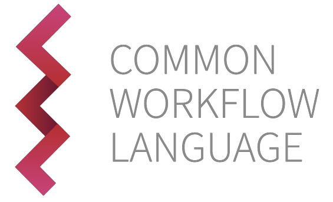
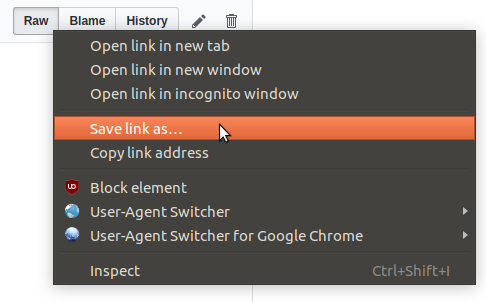
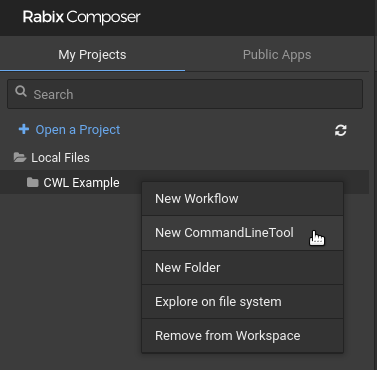
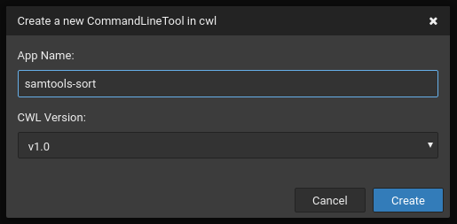
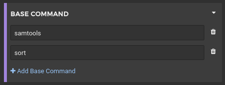
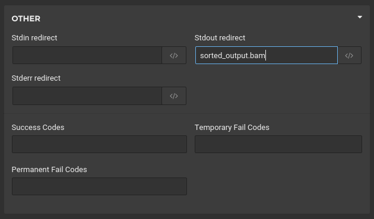
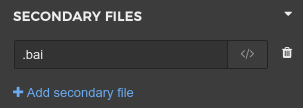
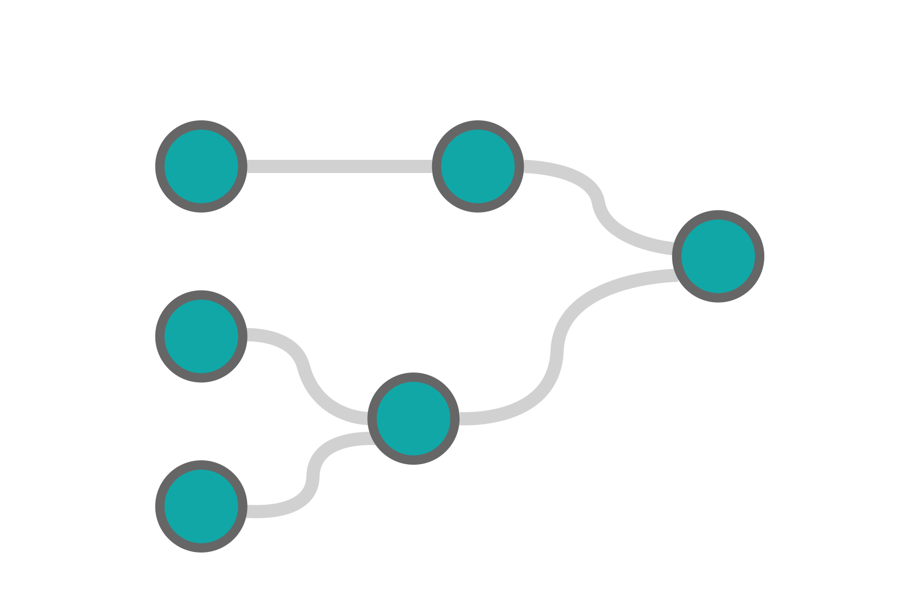

layout: true
class: content
---
# Part 1: Introduction
.center[

]
---
## Motivation

* Most bioinformatics involves running many command-line tools; aligners like `bwa` variant callers like `gatk`, and RNA
Seq tools like `edgeR`
* However, once this list of tools reaches a certain quantity and complexity, it becomes hard to  reproduce exactly what you ran and with what parameters
* A bash script may help with this, but proper workflows...

    * Run fully parallel to speed up execution
    * Work automatically with batch systems like SLURM
    * Are written declaratively, allowing the system to work out the optimal order of execution for you
    * Save you having to hard-code input parameters and temporary files
    * Are much more readable than bash
---
## CWL Structure
* Tools
    * Are wrappers that describe to the CWL engine how a tool works
    * Include its inputs and outputs, and their format
    * Any given tool can have a "correct" tool definition, unlike a workflow
    * Some already exist for commonly used tools
* Workflows
    * Explain how tools are connected to each other and in what order
    * Are generally project-specific
    * Can be nested inside each other
---
## Tooling for CWL
* Rabix
    * <http://rabix.io/>
    * Is an open source toolkit for creating and running CWL
    * Its most useful tool is the Rabix Composer - an application for writing CWL tools and workflows graphically
* Toil
    * <http://toil.ucsc-cgl.org/>
    * CWL has a number of "executors" - applications that can actually run CWL
    * Toil is the best supported executor - it can run workflows on your laptop, on a cluster, on NeCTAR, on AWS, or an a number of other platforms
    * To install Toil for CWL, run `pip install toil[cwl]`
---
## Workshop Goal
* By the end of the workshop we intend to have a fully-functioning somatic variant calling pipeline
* This means, it should take sequencing reads, as if from a cancer patient, and determine the DNA mutations that have
    occurred in their tumour
* Most of the exercises will contribute to this goal, so don't delete what you've written!

---
# Part 2: Tools
.center[

]
---
## Obtaining Tool Definitions

There are a few useful sources of CWL tool definitions:
* Dockstore
    * <https://dockstore.org>
    * Dockstore - a database of CWL and WDL workflows and tools
    * Once you find a tool definition you like, click "Files" → "Descriptor Files" → Download
.center[

]
---
## Obtaining Tool Definitions

There are a few useful sources of CWL tool definitions:
* Official CWL Workflows Repository
    * <https://github.com/common-workflow-language/workflows>
    * Once you find a tool definition you like, right-click on the "Raw" button and click "Save link as" section
.center[

]
---
## Obtaining Tool Definitions
.alert.alert-primary[
.alert-heading[
### Exercise
]
* Try to find a simple wrapper for the tool `bwa mem` from the
* Download that tool definition, and run it on the provided data with `toil-cwl-runner bwa.cwl` (it should prompt you
    on how to specify the input files)
* Save this tool definition - we'll use it in our pipeline later
]
* This didn't do much beyond just running the `bwa` tool
* However, it did ensure the tool ran in a Docker container with BWA installed
---
## More on CWL Tools

* At minimum, a CWL tool definition must have three things
    * A command (to to run
    * A list of inputs (command line arguments and stdin)
    * A list of outputs (files and stdout)
* We will investigate how to make these tool definitions first using Rabix, and then from scratch
---
# Wrapping Samtools
.alert.alert-primary[
.alert-heading[
### Exercise
]
Follow along with the instructions to make a tool wrapper for `samtools sort`
]
---
## Exercise - Wrapping BWA
1\. Start by making a new tool definition in Rabix

.center[

]
---
## Exercise - Wrapping BWA
2\. Name it after the tool you're wrapping

.center[

]
---
## Exercise - Wrapping BWA
3\. Add the "base command" - the fixed part of the command that will never change

.center[

]
---
## Exercise - Wrapping BWA

4\. Define the inputs(s)

.center[

]
---
## Exercise - Wrapping BWA

5\. Define the output(s)

.center[

]
---
## Exercise - Wrapping BWA

6\. If the command produces output from stdout, you must specify that in the "Other" section

.center[

]
---
## Wrapping Freebayes
.alert.alert-primary[
.alert-heading[
### Exercise
]
* [Freebayes](https://github.com/ekg/freebayes) is a variant caller, which takes a BAM alignment and determines how this alignment differs from the "normal"
reference genome
* Freebayes is called on the command-line as follows:
    ```bash
    freebayes --fasta-reference h.sapiens.fasta NA20504.bam
    ```
* Write a new CWL tool wrapper for Freebayes that supports this command
]

---
## Docker
* We have given CWL instructions on how to *run* these tools, but not how to *get* these tools
* For this we can use Docker
* Docker images are tiny virtual machines that have applications pre-installed inside of them
* You can find docker images of many common bioinformatics tools in [Biocontainers](https://biocontainers.pro/registry/)
* Once you've found a Docker image, you can plug it into the "Docker Image" section in Rabix:

    

---
## Updating our tool to use Docker
.alert.alert-primary[
.alert-heading[
### Exercise
]
* Find an appropriate Docker image for `bwa`, `samtools sort` and `freebayes`, using Biocontainers
* Once you have found the right images, plug them into the "Docker Image" section
]

---
## Secondary Files
* Some files, like indexes, are never considered a main input file, but are instead designed to accompany another file,
for example `.bai` files which accompany `bam` alignments, and `.tbi` indices which accompany `vcf` variant calls.
* These are called secondary files:

.center[

]
---
## JavaScript Expressions
* Sometimes, some of the values in our CWL need to be calculated dynamically
* For example, a command might create an output file whosle nameis based on the input file
* For example, `gzip file.txt` produces `file.txt.gz`
* In order to do this, we can embed a JavaScript expression in some CWL fields
---
## Wrapping Samtools Index

* Next, we need to wrap `samtools` - a utility for working with alignment files
.alert.alert-primary[
.alert-heading[
### Exercise
]
* Use what you have learned from wrapping `bwa` to make a wrapper for the `samtools index` subcommand
* You can find the samtools manual, including all command-line flags for `samtools index` here: <http://www.htslib.org/doc/samtools.html#COMMANDS_AND_OPTIONS>
* The output from `samtools index` will be a BAM file, with its `.bai` index as a secondary file
]
---
## Tool YAML

* CWL tools are written in a structure called `YAML`
* To view the raw YAML in the Rabix viewer, click the "Code" tab at the top
* In YAML, key-value pairs in a dictionary are indicated by a colon `:` and list elements are indicated by a dash `-`:
* The sections we previously worked on correspond to sections in the yaml file:
    * "Base Command" → `baseCommand`
    * "Output Ports" → `outputs`
    * "Input Ports" → `inputs`
---
## Tool YAML
.row[
.col-sm[
```yaml
class: CommandLineTool
cwlVersion: v1.0
id: bwa
baseCommand:
  - bwa
  - mem
inputs:
  - id: reference
    type: File
    inputBinding:
      position: 0
  - id: reads
    type: 'File[]'
    inputBinding:
      position: 1
  - id: read_group
    type: string?
    inputBinding:
      position: 0
      prefix: '-R'
```
]

.col-sm[
```yaml
outputs:
  - id: alignment
    type: File
    outputBinding:
      glob: alignment.bam
label: bwa
stdout: alignment.bam
```
]
]
---
## Tool YAML

* This is a tool (as opposed to a workflow)
    ```yaml
    class: CommandLineTool
    ```
* This follows version 1.0 of the CWL standard:
    ```yaml
    cwlVersion: v1.0
    ```
* This tool is called `bwa`:
    ```yaml
    id: bwa
    label: bwa
    ```
* The base command is `bwa mem`:
    ```yaml
    baseCommand:
      - bwa
      - mem
      ```
---

## Tool YAML
.row[
.col-sm[
* The inputs:
    ```yaml
    inputs:
      - id: reference
        type: File
        inputBinding:
          position: 0
      - id: reads
        type: 'File[]'
        inputBinding:
          position: 1
      - id: read_group
        type: string?
        inputBinding:
          position: 0
          prefix: '-R'
    ```
]
.col-sm[
* The outputs (including stdout):
    ```yaml
    outputs:
      - id: alignment
        type: File
        outputBinding:
          glob: alignment.bam
    stdout: alignment.bam
```
]
]
---
## Wrapping VarDict
.alert.alert-primary[
.alert-heading[
### Exercise
]
* Use what you've learned about YAML tool definitions to write a tool definition for `VarDictJava`
]
---
# Part 3: Writing Workflows

---
## Workflows - Refresher

* Workflows define how your tools connect to each other to form a data flow
---
## Workflows in the Rabix Composer

* In rabix, you add tools to your workflow by dragging and dropping from the sidebar
* To connect the tools, you then drag a line between input ports and output ports
---
## Exercise - Making an RNA Seq Pipeline in Rabix
.alert.alert-primary[
.alert-heading[
### Exercise
]
* Make a basic workflow that connects `bwa` → `samtools sort` → `samtools index` → `freebayes`
]
---
## Scatter
---
.alert.alert-primary[
.alert-heading[
### Exercise
]
* Make a workflow that connects `bwa` → `samtools sort` → `samtools index` → `VarDict`, using scatter
]

---
## Workflows in CWL Files

---
.alert.alert-primary[
.alert-heading[
## Exercise - Manual Workflow
]
* Using YAML, re-implement the basic germline variant calling workflow
]
---
# Part 4: Sharing CWL

---
# References
* https://openclipart.org/detail/28286/icontool
* https://github.com/common-workflow-language/logo/blob/master/LICENSE.md
